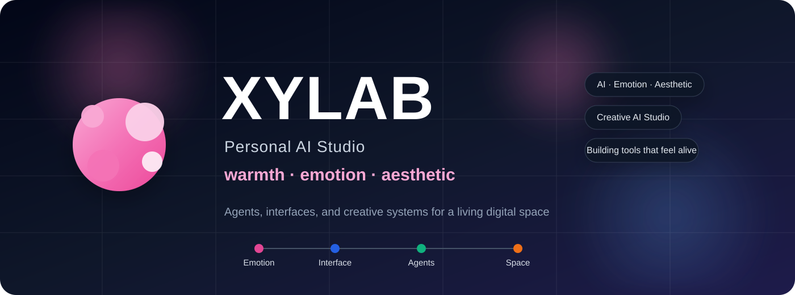
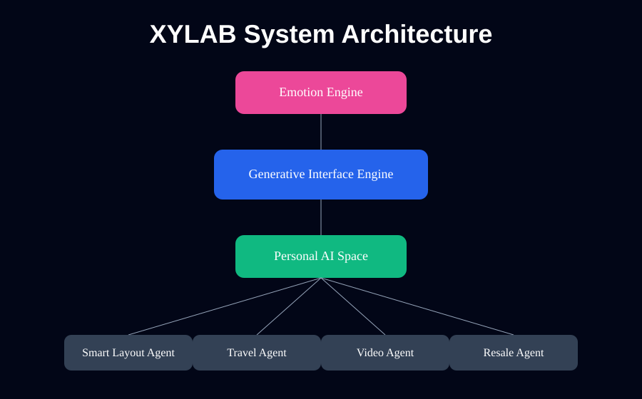
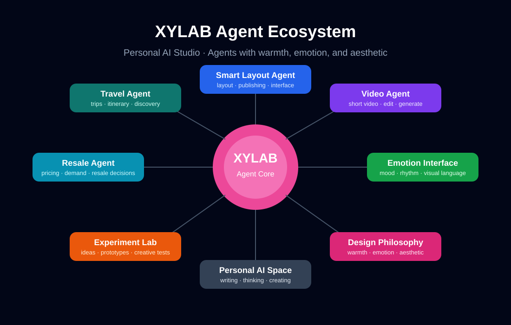

<p align="center">
  
</p>

<div align="center">

# ✨ XYLAB

### AI · Emotion · Aesthetic

A personal creative AI studio exploring  
AI tools with **warmth, emotion, and aesthetic beauty**


</div>

---

<div align="center">

**Building AI tools that feel alive**

</div>

---

# 🌙 Studio Philosophy

Most AI tools focus on **capability and efficiency**.

XYLAB explores something different.

Technology should be powerful —  
but the tools we interact with every day should also feel:

• warm  
• expressive  
• beautiful  

The core idea behind XYLAB:

```
Emotion → AI → Interface
```

Interfaces should adapt not only to what you do  
but also to **how you feel**.

Less like software.  
More like a **living digital space**.

---

# 🌌 The XYLAB Universe

```
                         ✨ XYLAB ✨
                   AI · Emotion · Aesthetic


                            Ada
                             │
                             │
                      Personal AI Space
                             │
               ┌─────────────┴─────────────┐
               │                           │
               ▼                           ▼

       🎨 Interface Space           🤖 Agent Space
      Emotion-driven UI             AI Capabilities


    💃 Dance Mode                Smart Layout Agent
    energetic creation

    🧘 Core Mode                 Travel Agent
    deep focus

    🎈 Play Mode                 Video Agent
    playful exploration
```

XYLAB is not just a collection of tools.

It is a **creative AI studio** where ideas evolve into  
small, living systems.

---

# 🧠 System Architecture

<p align="center">
  
</p>

The XYLAB system is structured as a layered creative stack:

```
User
 ↓
Emotion Signal
 ↓
Emotion Engine
 ↓
Generative Interface Engine
 ↓
Personal AI Space
 ↓
AI Agents
```

Traditional software:

```
Function → Interface
```

XYLAB explores:

```
Emotion → AI → Interface
```

---

# 🕸 XYLAB Agent Ecosystem

<p align="center">
  
</p>

XYLAB is growing into a **personal AI ecosystem**.

Each agent plays a role inside a larger creative system.

| Agent | Purpose |
|------|------|
| Smart Layout Agent | AI-powered layout and publishing system |
| Travel Agent | trip discovery, planning, and itinerary design |
| Video Agent | creative short video generation and editing |
| Resale Agent | analyze demand and optimize resale decisions |

Together they form a **creative AI studio for thinking, creating, and exploring**.

---

# 🎨 Emotion Interface

Instead of rigid UI modes like **Light Mode** or **Dark Mode**,  
XYLAB experiments with emotional spaces.

| Theme | Energy | Experience |
|------|------|------|
| 💃 Dance Mode | Energetic | expressive layouts and bold visuals |
| 🧘 Core Mode | Focused | minimal structure and clarity |
| 🎈 Play Mode | Playful | creative exploration |

Interfaces adapt to your **energy and mood**.

---

# 🚀 Current Projects

### Smart Layout Agent

An AI-powered layout engine that transforms structured content into beautifully styled interfaces.

Workflow:

```
Markdown
   ↓
Layout Engine
   ↓
Styled HTML (inline CSS)
   ↓
Ready for publishing
```

Designed for:

- writers  
- creators  
- AI content workflows  
- social publishing platforms  

---

### Travel Agent

A personal AI assistant designed for discovering destinations,  
planning trips, and building travel itineraries.

---

### Video Agent

Tools for generating and editing short-form creative video content.

---

### Resale Agent

An intelligent assistant for resale decisions.

Helps track product value, analyze market demand,  
and optimize resale opportunities.

---

# 🌠 Vision

Software evolution may look like this:

```
Web → Apps → Agents → Personal AI Spaces
```

XYLAB explores what those spaces might feel like.

Where tools are:

• intelligent  
• expressive  
• beautiful  

---

# 👩‍💻 Author

<div align="center">

**Ada Xia**

Builder · dancer · AI explorer

Technology should be powerful —  
but also **warm and beautiful**

✨

</div>
